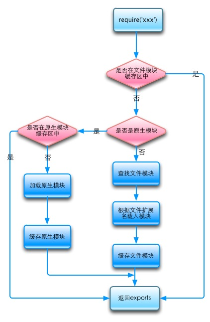

# Node.js 浅尝辄止

By Kaidi ZHU, R&D Engineer of  and .

* Huaban: http://huaban.com/
* +1: https://jiayi.la/
* My Github: https://github.com/XadillaX
* My Blog: http://xcoder.in/

## Node.js 在花瓣

整个花瓣网的 Web 层都使用 Node.js 开发。即除了任务调度系统、搜索引擎等。

[[Another Slide](http://belltoy.net/nodejs_in_huaban)]

## Node.js 在 +1

* Gateway Service (HTTPS Protocol)
* Administrator Web (HTTP/HTTPS Protocol)
* Some RPC Subservices ([Illyria](https://github.com/XadillaX/illyria2) Protocol)

## Node.js VS PHP/Python/Ruby/Java/etc.

* **异步非阻塞**。 ⭐️
* 单进程，单线程（部分）。
* PHP -> 使用 C 写插件，Node.js -> 使用 C++ 写插件。
* PHP 原则上来说不是独立的服务器。 
* Java 实现 Web Service 原则上也不是自建的服务器代码。
* 较 PHP / Python / Ruby 等更为强大好用的包管理机制和生态。

## 同步 I/O（Synchronous I/O）

### 常用的同步机制


### 常用的多进（线）程同步机制


> 多线程不仅占用多倍的系统资源，也闲置多倍的资源，这显然不合理。
>
> 图片及上句来源：[阮一峰](http://www.ruanyifeng.com/blog/2013/10/event_loop.html)

## Node.js 的异步 I/O

基于事件循环（Event Loop）。

### 鬼子进村策略（陈榕）

原始：

> 一遍遍地询问“鬼子进村了吗？”，“鬼子进村了吗？”

kqueue / IOCP / Event Loop 等：

> 派一些个人去站岗，鬼子来了就可以拿到通知。

### Event Loop


> 可能会有人觉得这 Event Loop 中间不还是有黄的块么？
>
> 但是那黄的块时间里面可以插入别人的请求和计算啊。

## Node.js 不适合计算密集型场景？

### 单线（进）程

至少我们看起来、用起来通常是单线程单进程的。

**举个例子：**

> Web 服务器的一个请求计算密集占了 CPU，会影响到其它所有请求的。
>
> 所谓 PHP 不会，实际上是 Apache + PHP 或者 Nginx + PHP 不会——CPU 之类的调度在 Apache 或者 Nginx 层就已经做好了。

所以，实际上无论是什么语言，在 Web 应用层处理这些事情都是不适合的，至少在没加上多进程等及调度之前。

### 解决办法

1. 开一到多个子进程专门处理计算密集型的事情，并且通过进程间通信来达到数据交换。子进程内部可以自行实现一个任务队列，或者其它东西，或者直接就专门处理来到的任务即可。
2. 直接开一个子系统专门做这件事情，通过网络通信（HTTP / 自有协议等）进行交换数据。
3. 做一个任务调度系统，专门调度这些任务，每个任务都有自己对应的进程或者系统来处理。

事实上很多 Web 或者 App 的应用服务端都不能做计算密集型的运算，否则就会阻塞它本身。

而 Node.js 同样可以用来做处理这些计算的真·后端系统，事实上花瓣就有这样的服务。最多可能是计算效率或者性能会不如别的一些语言，但绝不至于到不适合计算密集型的场景——只要架构得当，除非你要它跟 C 语言 C++ 这类相比。

## Node.js 真正不适合的场景

* 与 C / C++ 相提并论等。
* 实时性要求高的场景——GC 过程中会产生卡顿，并且很难优化。这是基本上所有有 GC 特性的语言的通病。
* ~~不关心吞吐率或者不需要异步的场景（如自动化脚本等），用更熟悉的语言更好。~~然而实际上我更熟悉的就是 Node.js，所以用起来反而比其它语言更顺手。
* ~~强类型语言强迫症，无法接受，当 Node.js 这类动态语言只是个玩具看待的就没办法了。~~然而实际上我也是 C++ 过来的，并且欲罢不能。
* 颠覆某个强硬的生态圈。比如说 Hadoop / Storm 这类。并不是说 Node.js 不能做，而是说人家已经有成熟的一套你拿过来用就是了，如果用 Node.js 你要付出非常大的成本来研发，成本上合不来。当然非常鼓励有人这么做。

> 整理自 [51CTO](http://developer.51cto.com/art/201403/431699_all.htm)

## Node.js 的优点

* 基于 Google Chrome V8 引擎。
* 异步 I/O 减少了阻塞。
* 理论上的单线程，可以解放脑袋，不用想莫名其妙的死锁和等待等问题。
* 强大的包管理机制。
* 活跃的包生态圈。

## V8 引擎

1. 本来 JS 的引擎没那么快。
2. 后来打西边儿来了个 Lars Bak。
3. 话说 Lars 本是那 Sun 的工程师，搞 JVM 的开发。
4. 后来啊他 Biu 一下跑谷歌那旮旯去了，V8 虚拟机就他主导来搞了。
5. 于是 JVM 中的先进技术就被带到 V8 里去了。
6. 所以其实 Node.js 的效率并不会很低。

## 理论上的单线程

> 我们所有的工作（除非你用黑科技开启了多线程）都不需要考虑死锁之类的资源抢占问题，所有任务都被切成小块执行。
>
> 不过在 Node.js 自身内部会给你开启多个线程来处理一些任务，不过我们感知不到。

这个小块通常是基于一个一段同步代码的。

所以说在大量同步代码，没有异步代码的时候，同样会造成其它任务的阻塞。

V8 底层的 [libuv](https://github.com/libuv/libuv) 库将不同的任务排队，并分配给不同线程，形成一个事件循环，以异步方式执行并返回。

但是你也可以使用一些黑科技库，或者自己写一个 C++ 的 addon，在里面开启多线程。（当然通常不推荐这么做）

## NPM 包管理器

最常用的 Node.js 的包管理器，当然有时候也可以用于前端 Javascript。

### 管理方式

在 [package.json](https://github.com/XadillaX/illyria2/blob/develop/package.json) 里面写依赖。

通过 `$ npm install 包名 --save` 将依赖写入 `package.json` 并安装到 `node_modules` 目录下。

### 加载包方式

通常使用下面代码载入包：

```javascript
var foo = require("bar");
```

## 独到之处

### 兼容依赖

> `B` 依赖 `A` 的 `1.0` 版本，`C` 依赖 `A` 的 `2.0` 版本。然而 `A` 的这两个版本并不相互兼容。
>
> (◍•ᴗ•◍) ゝ怎么办？

很多人视 NPM 的这种方式为糟粕，就想改掉。

然而我却喜欢得要紧。都什么年代了，还差那么点代码的硬盘空间？

### 原理

得益于 Javascript 的闭包特性。

可以理解为：

```javascript
function foo() { console.log("bar"); };
module.exports = foo;
```

被包装为：

```javascript
(function() {
    var module = { exports: {} };
    var exports = module.exports;

////////////////////////////////

function foo() { console.log("bar"); };
module.exports = foo;

////////////////////////////////

    return module;
})();
```

那么 `var temp = require("foo");` 就相当于：

```javascript
var temp = (function() {
    var module = { exports: {} };
    var exports = module.exports;

////////////////////////////////

function foo() { console.log("bar"); };
module.exports = foo;

////////////////////////////////

    return module;
})();
```

> 然而实际上 require 只作一次载入，之后 require 同一个文件只是从缓存中取出，并不会再执行一遍里面的函数。

## 续·require

代码：

```javascript
console.log("123");
module.exports = {
    foo: "bar",
    baz: "bay"
};
```

想要 require 它的话，简化下来的硬编码代码就类似于：

```javascript
var ___ = {};

function require(path) {
    if(___[绝对路径] !== undefined) {
        return ___[绝对路径];
    }

    // 假设只有一个文件，我们硬编码
    ___[绝对路径] = (function() {
        var module = { exports: {} };
        var exports = module.exports;

        console.log("123");
        module.exports = {
            foo: "bar",
            baz: "bay"
        };

        return module;
    })();

    return ___[绝对路径];
}
```

### NPM 得益于闭包的原因

不存在命名空间的干扰或者污染，理论上就算同个包的不同版本依然可以共存于不同目录下。

## require 的寻找位置



> 图片来源：http://liuzhichao.com/p/1669.html

## 包生态圈

> http://npmjs.org/

写这个 slide 的时候：

* 165,462 total packages
* 79,874,016 downloads in the last day
* 437,654,352 downloads in the last week
* 1,782,383,002 downloads in the last month

## 推荐一些包

> 学 Node.js，到底是学它的语法呢？还是学各种 SDK 的 API？
> ——一个不愿意透露姓名的同事

其实 Node.js 或者说 Javascript 的语法即特性来说都是非常简单的，底层也提供了足够的保障。

所以接下去使用 Node.js 的一个理由就是它提供了足够多的三方包，非常大程度地降低了编码的各种重复劳动。

## Express.js

> http://expressjs.com/

目前（可能是）最流行的 Node.js 的 Web 框架。

```javascript
var express = require('express');
var app = express();

app.get("/", function (req, res) {
    res.send("Hello World!");
});

var server = app.listen(3000, function () {
    var host = server.address().address;
    var port = server.address().port;

    console.log("Example app listening at http://%s:%s", host, port);
});
```

> 各种中间件支持，生态圈也比较完善。

## Pomelo

> http://pomelo.netease.com/

网易出品的游戏服务端框架。实际上也可用作一些实时性较强需要长连接的应用。

> http://pomelo.netease.com/lordofpomelo/

## Async

> https://github.com/caolan/async

异步流程控制库。

## 回调地狱

```javascript
// 假设 step1/2/3 无先后顺序

step1(function(err, v1) {
    step2(function(err, v2) {
        step3(function(err, v3) {
            // do somethig with the err or values v1/v2/v3
        }
    }
});
```

### 用 Async 解决

```javascript
async.series([ step1, step2, step3 ], function(err, values) {
    // do something with the err or values[0/1/2]
});
```

## 使用 [PM2](https://github.com/Unitech/pm2) 管理/部署应用

+ 进程管理。
  - 
  - `$ pm2 list`
  - `$ pm2 <stop|restart|delete> <app_name|id|'all'|json_conf>`
  - etc.
+ CPU / 内存监控。
  - `$ pm2 monit`
  - 
+ 日志设施。
  - `$ pm2 logs ...`
  - 
+ 负载均衡 / 0 秒停机重启。
+ 启动脚本生成。
+ 开发模式。
  - `$ pm2-dev run my-app.js`
+ 执行下一代 Javascript（ES6 / ES7）。
+ [Keymetrics](https://app.keymetrics.io/#/register) 监控。
  - 

## NVM (Node Version Manager) 切换版本

+ `$ nvm install 0.10`
+ `$ nvm use 0.10`
+ `$ nvm run 0.10 --version`
+ `$ nvm exec node --version`
+ `$ nvm install stable`
+ `$ nvm install iojs`
+ etc.

## 周边产品

+ **[NW.js](http://nwjs.io/):** 使用 Node.js 写桌面应用的一个框架，基于 Webkit，跨平台。因特尔开源产品部出品。
+ **[electron](http://electron.atom.io/):** 同上，为 GitHub 出品。

# FAQ

***Thanks***
